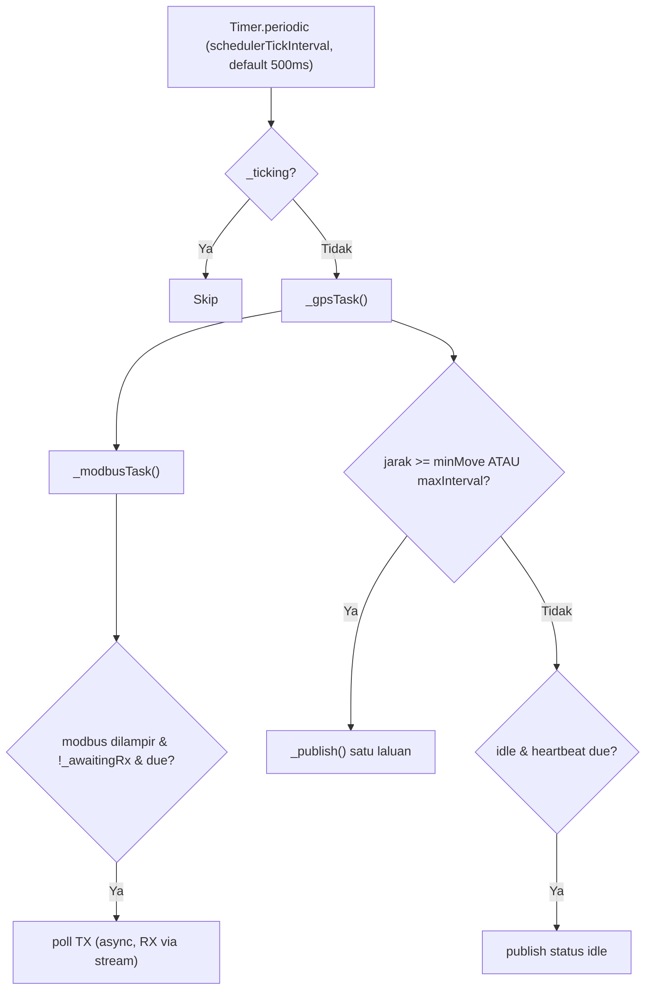

# Pelan: Satu Scheduler Ticker untuk GPS + Modbus

## Matlamat
- Satu `Timer.periodic` (default 500ms, dalam const) menggantikan idle watchdog/heartbeat timer dan timer poll Modbus.
- Publish ditapis ikut **jarak meter** + **throttle** + **maxInterval** supaya gap konsisten dan tiada lompatan.
- Buang `pauseGps`/`resumeGps` — satu laluan publish sahaja, jadi GPS dan Modbus boleh jalan serentak tanpa pause.
- Flag penjaga (reentrancy) elak operasi bertindih tanpa perlu multi-core.

## Seni bina baharu

Ticker hidup dalam `PublishService` (singleton yang sedia ada urus masa publish). Skrin transmission hanya **melampirkan** hook poll Modbus, bukan memiliki timer sendiri.

## Perubahan fail

### 1. Const baharu di [lib/core/constants/tracking_publish_config.dart](lib/core/constants/tracking_publish_config.dart)
- `schedulerTickInterval = Duration(milliseconds: 500)` (yang diminta — mudah ubah).
- `minMoveDistanceMeters = 5` (anggap bergerak / layak publish; ganti peranan `coordinateChangeEpsilonDegrees`).
- `redundantDistanceMeters = 2` (jarak terlalu kecil -> skip publish koordinat).
- `maxPublishInterval = Duration(seconds: 10)` (flush pending walau throttle).
- `idleConfirmDuration = Duration(seconds: 60)` (diam cukup lama -> idle).
- Kekal: `gpsChangeMinGap` (throttle 3s), `idleHeartbeatInterval` (30s), `maxAcceptableAccuracyMeters`.
- `coordinateChangeEpsilonDegrees` boleh dibuang selepas tukar ke jarak meter.

### 2. Helper jarak di [lib/core/services/location_service.dart](lib/core/services/location_service.dart)
- Tambah fungsi statik guna `Geolocator.distanceBetween(...)` (geolocator sudah diimport) untuk kira meter antara dua `LocationFix`.

### 3. Teras: [lib/core/services/publish_service.dart](lib/core/services/publish_service.dart)
- Tambah state: `_pendingFix`, `_lastPublishedFix`, `_dirty`, `_lastPublishAt`, `_lastMoveAt`, enum `_motion {unknown, moving, idle}`, dan flag `_ticking`, `_publishing`, `_fetchingFix`.
- Tambah ticker tunggal `_startScheduler()`/`_stopScheduler()` guna `schedulerTickInterval`; `_onTick()` panggil `_gpsTask()` kemudian `_modbusTask()` dengan guard `_ticking`.
- `_gpsTask()`: baca `_location.lastFix` -> kira jarak dari `_lastPublishedFix` -> kemas kini moving/idle (dengan hysteresis) -> set `_pendingFix`/`_dirty` -> putuskan publish (jarak >= `minMoveDistanceMeters` DAN (throttle `gpsChangeMinGap` lepas ATAU `maxPublishInterval` lepas)); jika idle dan `idleHeartbeatInterval` due -> publish `status_live: idle`.
- Buang `pauseGps()`/`resumeGps()`/`_gpsPaused`, idle watchdog (`_idleWatchTimer`) dan heartbeat (`_idleHeartbeatTimer`) — digantikan ticker. Ganti `_coordinatesChanged()` (epsilon) dengan semakan jarak meter.
- Modbus: tambah `attachModbusPoller({required bool Function() canPoll, required void Function() pollOnce})` dan `detachModbusPoller()`. `_modbusTask()` panggil `pollOnce()` hanya bila dilampir, `!_awaitingRx` (dikongsi), dan `pollInterval` device telah lepas. `publishModbus()` dikekalkan sebagai laluan sensor (dipanggil bila RX masuk).
- Pastikan satu laluan: setiap tick, jika ada data Modbus baharu -> publish dengan `sensor_data` sebenar; jika tidak -> publish GPS `[-1]`.

### 4. Skrin transmission [lib/presentation/modbus_transmission_screen/modbus_transmission_screen.dart](lib/presentation/modbus_transmission_screen/modbus_transmission_screen.dart)
- Buang `_nextPollTimer` dan `_scheduleNextPollCycle()` — penjadualan poll datang dari ticker pusat.
- `onStartLoop()`: ganti `PublishService().pauseGps()` dengan `PublishService().attachModbusPoller(...)` (poll guna `_kickPollCycle`/`_sendPollRequest`, `canPoll` = `isLooping && _transport != null && !_awaitingRx`).
- `onStopLoop()`/`dispose()`/`_handleTransportLost()`: ganti `resumeGps()` dengan `detachModbusPoller()`.
- `_finishPollCycle()`: jangan reschedule sendiri; hanya `_awaitingRx = false` (tick seterusnya akan poll). Kekal `_rxTimeoutTimer` untuk timeout RX.

### 5. [lib/presentation/home_screen/home_screen.dart](lib/presentation/home_screen/home_screen.dart)
- Kekal langganan `LocationService().stream` untuk **kemas kini UI** sahaja (koordinat + indikator moving).
- Buang panggilan `PublishService().publishGps(fix)` dari listener — publish kini diuruskan ticker. (`publishGps` boleh dibuang atau jadi no-op.)

## Di luar skop (kekal seperti sedia ada)
- Tracking semasa **lock screen/background**: timer Dart berhenti bila app suspend; `main.dart` kekal publish offline snapshot pada `paused`. Perlu background location service berasingan jika mahu — bukan sebahagian pelan ini.
- **Smooth di peta** (lerp/extrapolate) ialah kerja di penonton peta/dashboard, bukan dalam app ini.

## Risiko & nota
- Poll Modbus kekal request/response (gated `_awaitingRx`); cadence kini = tick 500ms tertakluk `pollInterval` device. Jika `pollInterval` < 500ms, kadar efektif dihadkan oleh tick — boleh laraskan `schedulerTickInterval`.
- Ujian manual: GPS bergerak (titik konsisten, tiada lompat), diam (heartbeat idle), Modbus polling serentak dengan GPS (tiada pause), keluar skrin (exit snapshot betul).